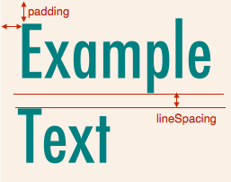

[](https://nodei.co/npm/text2png/)
[](https://badge.fury.io/js/text2png)
[](https://travis-ci.org/tkrkt/text2png)

# text2png: text-to-png generator for Node.js

```js
text2png('Create png image\nfrom multi-line text!');
```


## Quick start

text2png depends on [node-canvas](https://github.com/Automattic/node-canvas).
See [node-canvas wiki](https://github.com/Automattic/node-canvas/wiki) on installing node-canvas.

```
$ npm install text2png
```

```js
var fs = require('fs');
var text2png = require('text2png');
fs.writeFileSync('out.png', text2png('Hello!', {color: 'blue'}));
```

## Option

``text2png(text, option)``

|param|default|
|---|---|
|text|(required)|
|option.font|'30px sans-serif'|
|option.textAlign|'left'|
|option.color (or option.textColor)|'black'|
|option.backgroundColor (or option.bgColor)|'transparent'|
|option.lineSpacing|0|
|option.strokeWidth|0|
|option.strokeColor|'white'|
|option.padding|0|
|option.padding(Left\|Top\|Right\|Bottom)|0|
|option.borderWidth|0|
|option.border(Left\|Top\|Right\|Bottom)Width|0|
|option.borderColor|'black'|
|option.localFontPath||
|option.localFontName||
|option.output|'buffer'|

``option.color = '#000' | 'rgb(0, 0, 0)' | 'black' | ...``

``option.output = 'buffer' | 'stream' | 'dataURL' | 'canvas'``

``option.strokeWidth = 1 | 2 | ... `` A padding may have to be set to avoid cutoff of stroke

``'canvas'`` returns [node-canvas](https://github.com/Automattic/node-canvas) object.

If you want to use any custom fonts without installing, use `localFontPath` and `localFontName` property.

```js
text2png('with custom fonts', {
  font: '50px Lobster',
  localFontPath: 'fonts/Lobstar-Regular.ttf',
  localFontName: 'Lobster'
});
```

## Command line interface

```
$ npm install -g text2png
$ text2png --help
$ text2png -t "Hello!" -o "output.png"
```

## Example

```js
text2png('Example\nText', {
  font: '80px Futura',
  color: 'teal',
  backgroundColor: 'linen',
  lineSpacing: 10,
  padding: 20
});
```



Enjoy!
